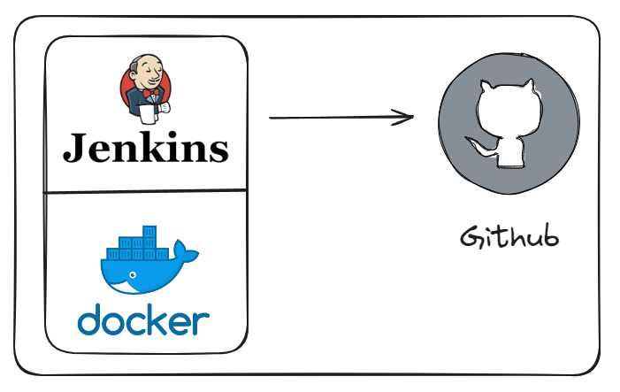
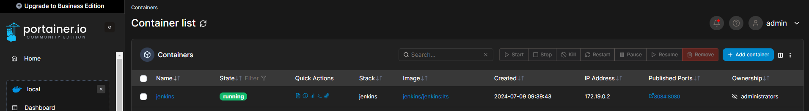
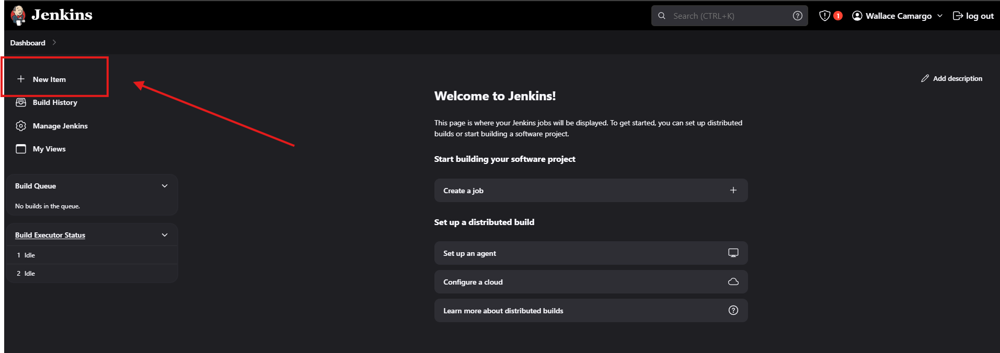
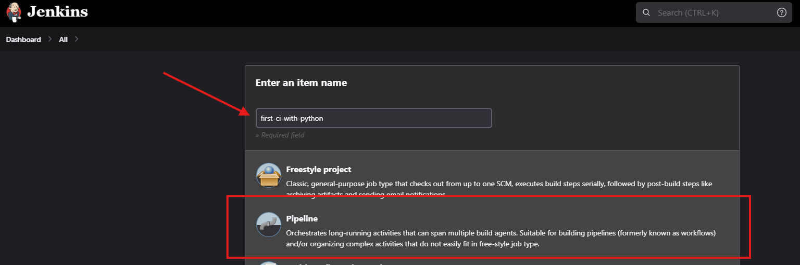
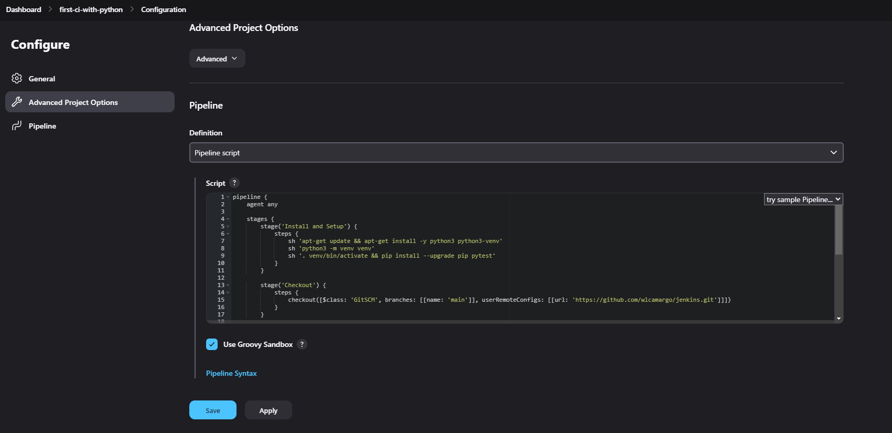
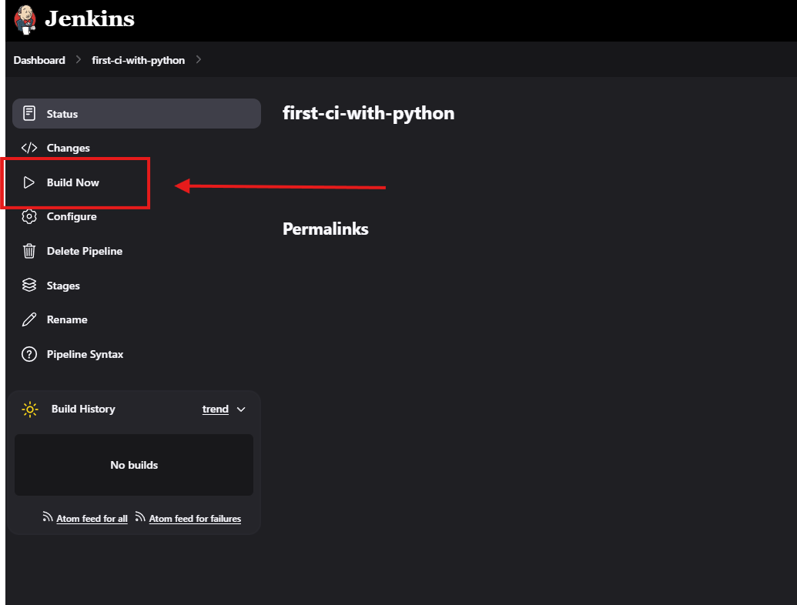
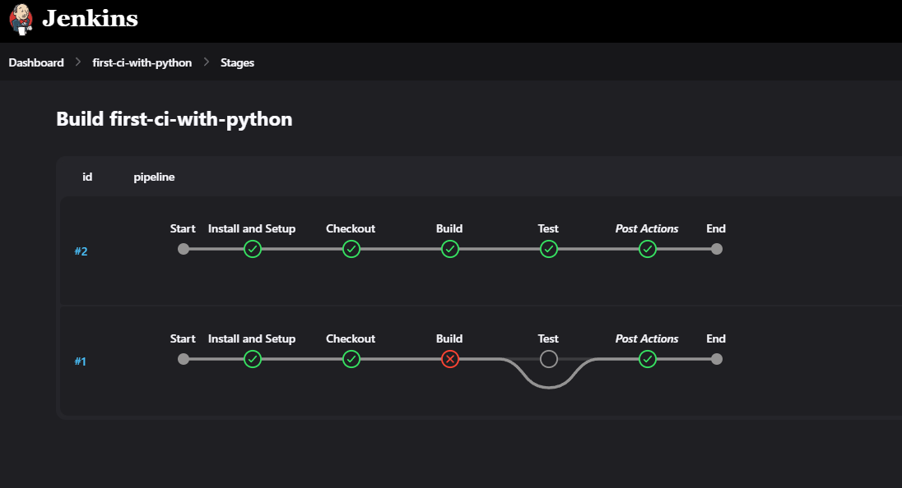
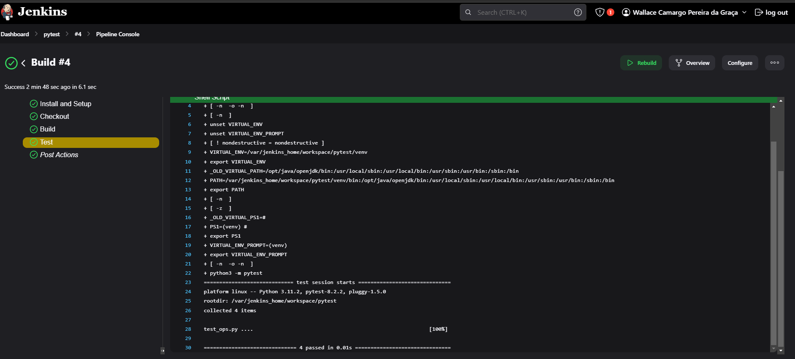

# Pipeline Jenkins With Python

O objetivo do projeto é realizar uma pipeline teste em códigos Python com o Jenkins.

O Jenkins vai realizar um teste a partir de um código no repositório do Github.

O teste é muito simples, apenas realizando operações matemáticas com Python e testando o resultado, mas serve para que possamos entender a lógica da ferramenta.

## Arquitetura



## Ferramentas
* Docker
* Jenkins
* Pytest
* Python
* Github

## Pré-requisitos
- Docker
- Um Repo no GitHub

## Como desbloquear os pré-requisitos?
### Docker
Como instalar o Docker:

https://www.youtube.com/playlist?list=PLbPvnlmz6e_L_3Zw_fGtMcMY0eAOZnN-H


### Repo no GitHub ou crie o seu
Pode utilizar o mesmo deste exemplo, pois ele é público.


## Como instalar o Jenkins?
Na pasta raiz do projeto execute o comando:
```
sudo docker compose up -d
```
Sample Jenkins running:


## Como Acessar o Jenkins?

localhost:8084

### Comando para pegar a senha de primeiro acesso
```
docker exec jenkins cat /var/jenkins_home/secrets/initialAdminPassword
```
## Sobre a pipeline
A pipeline vai instalar as dependências, tais como: ```Python```, Ambiente Virtual, Ativação do ambiente virtual, Checkout no Repositório do ```Github``` e um ```teste``` no código Python. 

## Como criar a pipeline?
### Steps

1 - Clique em ```new item``` no canto superior esquerdo.
sample:
    

2- Dê um nome para a pipeline, clique em ```pipeline``` e depois avance.
    

3 - Copie a pipeline da pasta ```pipeline``` para o Jenkins e  faça o salve. 
 

4 - Execute a pipeline clicando em ```Build Now```
 

### Exemplos:

Sample pipeline executed:


Sample test:



## Conclusão
Parabéns! Sua pipeline com o Jenkins já está pronta!

## 📚 References
https://www.youtube.com/watch?v=6njM8g5hKuk 

## Developer
| Desenvolvedor      | LinkedIn                                   | Email                        | Portfólio                              |
|--------------------|--------------------------------------------|------------------------------|----------------------------------------|
| Wallace Camargo    | [LinkedIn](https://www.linkedin.com/in/wallace-camargo-35b615171/) | wallacecpdg@gmail.com        | [Portfólio](https://wlcamargo.github.io/)   |

